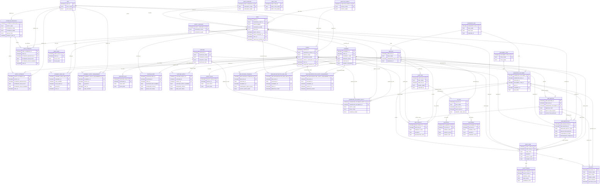

# Europa Life ERD

Generated from `sql/schema.sql` for the public repository.

```mermaid
erDiagram
    UNIT ||--o{ ATTRIBUTE_DEFINITION : default_unit
    UNIT ||--o{ PART : part_unit
    UNIT ||--o{ SUPPLY : supply_unit
    UNIT ||--o{ PART_ATTRIBUTE : attribute_unit
    UNIT ||--o{ SUPPLY_ATTRIBUTE : attribute_unit
    UNIT ||--o{ ASSEMBLY_BOM_LINE : bom_unit
    UNIT ||--o{ ASSEMBLY_SUPPLY_REQUIREMENT : supply_unit

    LIFECYCLE_STATUS ||--o{ PART : part_status
    LIFECYCLE_STATUS ||--o{ SUPPLY : supply_status
    PART_TYPE ||--o{ PART : classifies
    PART_CATEGORY ||--o{ PART : groups
    SUPPLY_CATEGORY ||--o{ SUPPLY : groups

    SUPPLIER ||--o{ SUPPLIER_ALIAS : has_alias
    SUPPLIER ||--o{ SUPPLIER_PART : supplies_part
    SUPPLIER ||--o{ SUPPLIER_SUPPLY : supplies_supply

    PART ||--o{ PART_ALIAS : has_alias
    PART ||--o{ PART_ATTRIBUTE : has_attribute
    PART ||--o{ SUPPLIER_PART : sourced_as
    PART ||--o{ ASSEMBLY_BOM_LINE : child_part
    PART ||--o| ASSEMBLY : assembly_part

    SUPPLY ||--o{ SUPPLY_ALIAS : has_alias
    SUPPLY ||--o{ SUPPLY_ATTRIBUTE : has_attribute
    SUPPLY ||--o{ SUPPLIER_SUPPLY : sourced_as
    SUPPLY ||--o{ ASSEMBLY_SUPPLY_REQUIREMENT : required_supply

    ATTRIBUTE_DEFINITION ||--o{ PART_ATTRIBUTE : defines
    ATTRIBUTE_DEFINITION ||--o{ SUPPLY_ATTRIBUTE : defines

    ASSEMBLY ||--o{ ASSEMBLY_BOM_LINE : has_components
    ASSEMBLY ||--o{ ASSEMBLY_SUPPLY_REQUIREMENT : has_supplies
    ASSEMBLY ||--o{ GENERATED_DOCUMENT : documented_by
    ASSEMBLY ||--o{ GENERATED_DOCUMENT_ENTITY : appears_as_truth
    ASSEMBLY ||--o{ NER_RESOLUTION : resolved_as
    ASSEMBLY ||--o{ NER_PACKAGE_COVERAGE : measured_by
    ASSEMBLY ||--o{ NER_RECONSTRUCTED_BOM_LINE : reconstructed_component
    ASSEMBLY ||--o{ NER_RECONSTRUCTED_SUPPLY_REQUIREMENT : reconstructed_supply
    ASSEMBLY ||--o{ AUDIT_CASE : audit_context

    GENERATED_RUN ||--o{ GENERATED_DOCUMENT : emits
    GENERATED_RUN ||--o{ NER_RUN : feeds
    DOCUMENT_TYPE ||--o{ GENERATED_DOCUMENT : types
    GENERATED_DOCUMENT ||--o{ GENERATED_DOCUMENT_ENTITY : expected_entities
    GENERATED_DOCUMENT ||--o{ NER_MENTION : produces_mentions
    GENERATED_DOCUMENT ||--o{ NER_CONFLICT : has_conflicts
    GENERATED_DOCUMENT ||--o{ AUDIT_CASE : audit_source
    GENERATED_DOCUMENT ||--o{ LLM_CALL : generation_call

    NER_RUN ||--o{ NER_MENTION : extracts
    NER_RUN ||--o{ NER_CONFLICT : records
    NER_RUN ||--o{ NER_PACKAGE_COVERAGE : measures
    NER_RUN ||--o{ NER_RECONSTRUCTED_BOM_LINE : reconstructs_bom
    NER_RUN ||--o{ NER_RECONSTRUCTED_SUPPLY_REQUIREMENT : reconstructs_supplies
    NER_RUN ||--o{ AUDIT_RUN : audited_by
    NER_RUN ||--o{ DQ_RUN : summarized_by

    NER_MENTION ||--o| NER_RESOLUTION : resolved_once
    NER_MENTION ||--o{ NER_CONFLICT : conflict_source
    NER_MENTION ||--o{ LLM_CALL : resolver_call
    NER_RESOLUTION ||--o{ AUDIT_CASE : audit_resolution

    PART ||--o{ GENERATED_DOCUMENT_ENTITY : appears_as_truth
    PART ||--o{ NER_RESOLUTION : resolved_as
    PART ||--o{ NER_CONFLICT : conflict_part
    PART ||--o{ NER_RECONSTRUCTED_BOM_LINE : reconstructed_part
    PART ||--o{ AUDIT_CASE : audit_part

    SUPPLY ||--o{ GENERATED_DOCUMENT_ENTITY : appears_as_truth
    SUPPLY ||--o{ NER_RESOLUTION : resolved_as
    SUPPLY ||--o{ NER_CONFLICT : conflict_supply
    SUPPLY ||--o{ NER_RECONSTRUCTED_SUPPLY_REQUIREMENT : reconstructed_supply
    SUPPLY ||--o{ AUDIT_CASE : audit_supply

    SUPPLIER ||--o{ GENERATED_DOCUMENT_ENTITY : appears_as_truth
    SUPPLIER ||--o{ NER_RESOLUTION : resolved_as

    AUDIT_RUN ||--o{ AUDIT_CASE : creates
    AUDIT_RUN ||--o{ DQ_RUN : summarized_by
    AUDIT_CASE ||--o{ AUDIT_FINDING : yields
    AUDIT_CASE ||--o{ LLM_CALL : audit_call
    DQ_RUN ||--o{ DQ_METRIC : has_metric
    DQ_RUN ||--o{ DQ_FINDING : has_finding

    UNIT {
        INTEGER UNIT_ID PK
        TEXT UNIT_CODE UK
        TEXT UNIT_NAME
    }
    LIFECYCLE_STATUS {
        INTEGER LIFECYCLE_STATUS_ID PK
        TEXT STATUS_CODE UK
        TEXT STATUS_NAME
    }
    PART_TYPE {
        INTEGER PART_TYPE_ID PK
        TEXT PART_TYPE_CODE UK
        TEXT PART_TYPE_NAME
    }
    PART_CATEGORY {
        INTEGER PART_CATEGORY_ID PK
        TEXT CATEGORY_CODE UK
        TEXT CATEGORY_NAME
    }
    SUPPLY_CATEGORY {
        INTEGER SUPPLY_CATEGORY_ID PK
        TEXT CATEGORY_CODE UK
        TEXT CATEGORY_NAME
    }
    DOCUMENT_TYPE {
        INTEGER DOCUMENT_TYPE_ID PK
        TEXT TYPE_CODE UK
        TEXT TYPE_NAME
    }
    ATTRIBUTE_DEFINITION {
        INTEGER ATTRIBUTE_DEFINITION_ID PK
        TEXT ENTITY_KIND
        TEXT ATTRIBUTE_CODE
        TEXT ATTRIBUTE_NAME
        TEXT VALUE_TYPE
        INTEGER DEFAULT_UNIT_ID FK
    }
    SUPPLIER {
        INTEGER SUPPLIER_ID PK
        TEXT SUPPLIER_CODE UK
        TEXT CANONICAL_NAME
        TEXT COUNTRY_CODE
        TEXT SUPPLIER_TIER
    }
    PART {
        INTEGER PART_ID PK
        TEXT CANONICAL_PART_ID UK
        TEXT PART_NUMBER UK
        TEXT CANONICAL_NAME
        TEXT REVISION
        INTEGER PART_TYPE_ID FK
        INTEGER PART_CATEGORY_ID FK
        INTEGER UNIT_ID FK
        INTEGER LIFECYCLE_STATUS_ID FK
    }
    ASSEMBLY {
        INTEGER ASSEMBLY_ID PK
        INTEGER PART_ID FK
        TEXT ASSEMBLY_CODE UK
        TEXT MISSION_PHASE
        TEXT CRITICALITY
        TEXT PARENT_PROGRAM
    }
    SUPPLY {
        INTEGER SUPPLY_ID PK
        TEXT CANONICAL_SUPPLY_ID UK
        TEXT SUPPLY_CODE UK
        TEXT CANONICAL_NAME
        INTEGER SUPPLY_CATEGORY_ID FK
        INTEGER UNIT_ID FK
        INTEGER LIFECYCLE_STATUS_ID FK
    }
    SUPPLIER_ALIAS {
        INTEGER SUPPLIER_ALIAS_ID PK
        INTEGER SUPPLIER_ID FK
        TEXT ALIAS_TEXT
        TEXT ALIAS_KIND
    }
    PART_ALIAS {
        INTEGER PART_ALIAS_ID PK
        INTEGER PART_ID FK
        TEXT ALIAS_TEXT
        TEXT ALIAS_KIND
    }
    SUPPLY_ALIAS {
        INTEGER SUPPLY_ALIAS_ID PK
        INTEGER SUPPLY_ID FK
        TEXT ALIAS_TEXT
        TEXT ALIAS_KIND
    }
    PART_ATTRIBUTE {
        INTEGER PART_ATTRIBUTE_ID PK
        INTEGER PART_ID FK
        INTEGER ATTRIBUTE_DEFINITION_ID FK
        TEXT ATTRIBUTE_VALUE_TEXT
        REAL ATTRIBUTE_VALUE_NUMERIC
        INTEGER UNIT_ID FK
    }
    SUPPLY_ATTRIBUTE {
        INTEGER SUPPLY_ATTRIBUTE_ID PK
        INTEGER SUPPLY_ID FK
        INTEGER ATTRIBUTE_DEFINITION_ID FK
        TEXT ATTRIBUTE_VALUE_TEXT
        REAL ATTRIBUTE_VALUE_NUMERIC
        INTEGER UNIT_ID FK
    }
    SUPPLIER_PART {
        INTEGER SUPPLIER_PART_ID PK
        INTEGER SUPPLIER_ID FK
        INTEGER PART_ID FK
        TEXT SUPPLIER_PART_NUMBER
        TEXT APPROVED_STATUS
        REAL BASE_UNIT_PRICE
    }
    SUPPLIER_SUPPLY {
        INTEGER SUPPLIER_SUPPLY_ID PK
        INTEGER SUPPLIER_ID FK
        INTEGER SUPPLY_ID FK
        TEXT SUPPLIER_SUPPLY_NUMBER
        TEXT APPROVED_STATUS
        REAL BASE_UNIT_PRICE
    }
    ASSEMBLY_BOM_LINE {
        INTEGER ASSEMBLY_BOM_LINE_ID PK
        INTEGER ASSEMBLY_ID FK
        INTEGER FIND_NUMBER
        INTEGER CHILD_PART_ID FK
        REAL QUANTITY
        INTEGER UNIT_ID FK
    }
    ASSEMBLY_SUPPLY_REQUIREMENT {
        INTEGER ASSEMBLY_SUPPLY_REQUIREMENT_ID PK
        INTEGER ASSEMBLY_ID FK
        INTEGER SUPPLY_ID FK
        REAL QUANTITY
        INTEGER UNIT_ID FK
        TEXT USE_CONTEXT
    }
    GENERATED_RUN {
        INTEGER GENERATED_RUN_ID PK
        TEXT RUN_LABEL UK
        TEXT ROOT_DIR
        TEXT CREATED_AT
    }
    GENERATED_DOCUMENT {
        INTEGER GENERATED_DOCUMENT_ID PK
        INTEGER GENERATED_RUN_ID FK
        TEXT PACKAGE_ID
        INTEGER DOCUMENT_TYPE_ID FK
        TEXT DOC_ID
        INTEGER ASSEMBLY_ID FK
        TEXT FILE_PATH
    }
    GENERATED_DOCUMENT_ENTITY {
        INTEGER GENERATED_DOCUMENT_ENTITY_ID PK
        INTEGER GENERATED_DOCUMENT_ID FK
        TEXT ENTITY_KIND
        TEXT ROLE_CODE
        TEXT SURFACE_FORM
    }
    NER_RUN {
        INTEGER NER_RUN_ID PK
        TEXT RUN_LABEL UK
        INTEGER GENERATED_RUN_ID FK
        TEXT CREATED_AT
    }
    NER_MENTION {
        INTEGER NER_MENTION_ID PK
        INTEGER NER_RUN_ID FK
        INTEGER GENERATED_DOCUMENT_ID FK
        TEXT MENTION_TEXT
        TEXT ENTITY_KIND_GUESS
        TEXT EXTRACTION_METHOD
    }
    NER_RESOLUTION {
        INTEGER NER_RESOLUTION_ID PK
        INTEGER NER_MENTION_ID FK
        TEXT RESOLVED_ENTITY_KIND
        TEXT RESOLUTION_METHOD
        REAL CONFIDENCE_SCORE
        TEXT PROVENANCE_STRENGTH
    }
    NER_CONFLICT {
        INTEGER NER_CONFLICT_ID PK
        INTEGER NER_RUN_ID FK
        TEXT CONFLICT_TYPE
        TEXT SEVERITY
        TEXT DESCRIPTION_TEXT
    }
    NER_PACKAGE_COVERAGE {
        INTEGER NER_PACKAGE_COVERAGE_ID PK
        INTEGER NER_RUN_ID FK
        TEXT PACKAGE_ID
        INTEGER ASSEMBLY_ID FK
        REAL COMPONENT_MATCH_RATE
        REAL SUPPLY_MATCH_RATE
    }
    NER_RECONSTRUCTED_BOM_LINE {
        INTEGER NER_RECONSTRUCTED_BOM_LINE_ID PK
        INTEGER NER_RUN_ID FK
        TEXT PACKAGE_ID
        INTEGER ASSEMBLY_ID FK
        INTEGER PART_ID FK
        INTEGER MENTION_COUNT
    }
    NER_RECONSTRUCTED_SUPPLY_REQUIREMENT {
        INTEGER NER_RECONSTRUCTED_SUPPLY_REQUIREMENT_ID PK
        INTEGER NER_RUN_ID FK
        TEXT PACKAGE_ID
        INTEGER ASSEMBLY_ID FK
        INTEGER SUPPLY_ID FK
        INTEGER MENTION_COUNT
    }
    AUDIT_RUN {
        INTEGER AUDIT_RUN_ID PK
        TEXT RUN_LABEL UK
        INTEGER NER_RUN_ID FK
        TEXT MODEL_NAME
        TEXT CREATED_AT
    }
    AUDIT_CASE {
        INTEGER AUDIT_CASE_ID PK
        INTEGER AUDIT_RUN_ID FK
        TEXT CASE_TYPE
        TEXT SEVERITY
        TEXT STATUS_CODE
        TEXT PROMPT_TEXT
    }
    AUDIT_FINDING {
        INTEGER AUDIT_FINDING_ID PK
        INTEGER AUDIT_CASE_ID FK
        TEXT FINDING_CODE
        TEXT RISK_LEVEL
        TEXT SUMMARY_TEXT
    }
    LLM_CALL {
        INTEGER LLM_CALL_ID PK
        TEXT STAGE_CODE
        TEXT ROLE_CODE
        TEXT MODEL_NAME
        TEXT RUN_CONTEXT
        INTEGER SUCCESS_FLAG
    }
    DQ_RUN {
        INTEGER DQ_RUN_ID PK
        TEXT RUN_LABEL UK
        INTEGER NER_RUN_ID FK
        INTEGER AUDIT_RUN_ID FK
        TEXT REPORT_HTML_PATH
    }
    DQ_METRIC {
        INTEGER DQ_METRIC_ID PK
        INTEGER DQ_RUN_ID FK
        TEXT METRIC_CODE
        REAL METRIC_VALUE
        TEXT METRIC_UNIT
    }
    DQ_FINDING {
        INTEGER DQ_FINDING_ID PK
        INTEGER DQ_RUN_ID FK
        TEXT FINDING_TYPE
        TEXT SEVERITY
        TEXT SUMMARY_TEXT
    }
```
